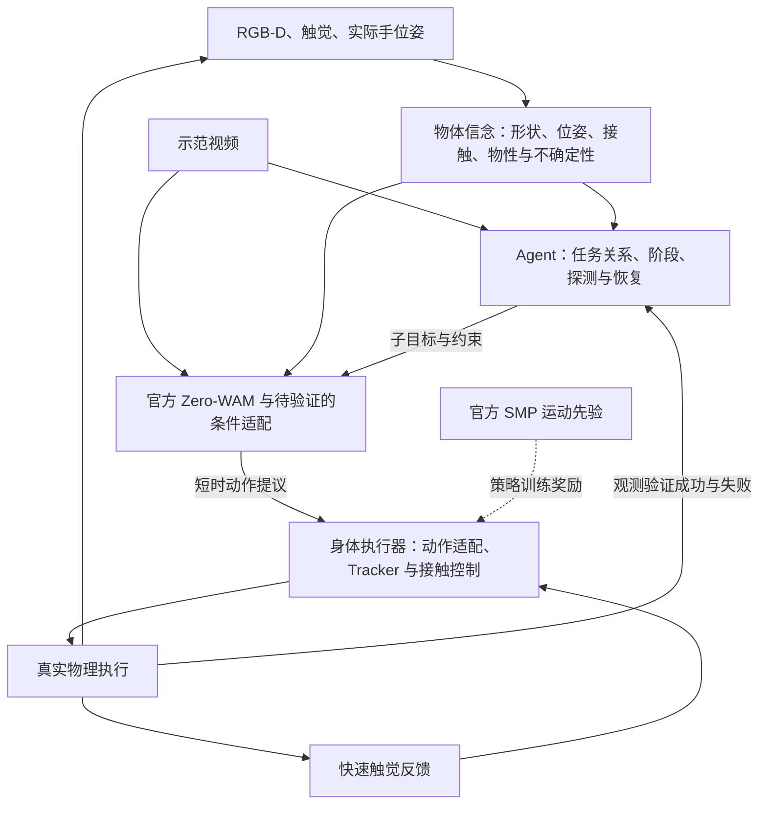

# 触觉物体想象、示范跟随与 agent 大脑：总体方案

2026-09-17，研究方案，未开始实现或训练。predictor 及准备中的修复实验全部暂停。官方下载与具体接口见 [发布核查](OFFICIAL_RELEASE_REVIEW.md)；下载完成须以 DOWNLOAD_COMPLETE.json 为准。

核心目标是：机器人通过视觉、触觉和自身几何形成可更新的物体认识，从示范理解目标变化，在自身身体约束下执行；agent 负责选择目标、探索和失败恢复。物体认识同时服务执行与主动感知，不把“生成漂亮物体”当最终目标。



图中是拟议职责划分，不表示模块已接通。Zero-WAM输出到身体执行器的动作接口需要数据和验证；SMP虚线代表训练约束，不是一个已经可运行的在线动作转换器。

## 1. 把“想象”分成两种可检验的量

第一种是**当前物体信念**：看不到的背面可能长什么样、物体在哪里、质量可能多大、此刻是否滑动。它要区分直接观测、由先验补全、尚未知晓三部分，允许多个可能答案。

第二种是**未来状态与动作提案**：物体/接触/机器人接下来可能怎样变化。Zero-WAM公开接口联合生成未来视频与动作；尚不能据此宣称支持任意固定动作A/B的反事实预测。后者若用于规划候选排序，需另做接口与后果校准。生成结果不是对真实物理后果的证明，也不能把生成的“成功画面”回写成观测。

拟议表征：

`belief = {track_id, shape_hypotheses, observed_surface, pose_hypotheses, velocity_estimate, mass_interval, friction/compliance_bounds, contact_graph, slip_evidence, visibility, timestamp, provenance, calibration_status}`。

track_id是当前观测轨迹身份，不偷用仿真资产ID。只有经覆盖率或可靠性验证的量才称为概率/分布；否则明确为未校准的候选、区间或UNKNOWN。第一版先实现局部接触与位姿约束，官方完整shape prior只补全假设；完整形状重建不是控制启动条件。零接触只约束实际传感器覆盖及其可靠检测范围，不代表整片空间已被证实为空。

刚体位姿与canonical形状分离；接触点、法向和力必须标明所在坐标系。未知质量/材质以未知或区间表示，不能用一个看似精确的默认数字代替。

## 2. 为什么手的几何是触觉语义的一部分

传感器局部接触点通过实际手位姿变换到同一世界坐标：`p_world = T_world_hand p_hand`，力和法向经对应旋转变换，力矩还需处理参考点平移。左右夹持与下方托举的差异来自接触位置、法向、接触连通关系及重力方向，单独比较若干力数值会丢掉这些信息。

融合输入包括实际关节/手位姿、传感器表面几何、法向压力与剪切、接触/无接触、时间戳，以及可用的RGB-D。视觉提供全局范围，触觉补充遮挡区域和接触处的几何/力学证据。累计旧接触必须经过物体运动估计重新配准，不能把移动物体上的世界坐标触点直接堆成静态点云。

现有仿真连续接触面流比27区域载荷传感器提供更多信息，二者不能混称相同输入。局部拟合法向、CAD fallback和按压力分配的剪切属于带假设的处理结果，须与独立实测值区分。力摘要能被反解只证明编码保留这些观测，不代表物体信息已经学会。主线优先参考NeuralFeels持续几何后端，接上经验证的局部观测适配；后续只选择一个完整官方shape prior补全，不同时堆叠多个重建模型。

质量与材质是单独的辨识任务：无未观测外力且运动可辨时，可用接触合力与加速度约束质量；未知桌面支撑、滑动导致的运动估计失真或未观测外力会破坏辨识条件。静态抓握通常只限制摩擦下界；摩擦、刚度、阻尼等需要相应激励与时间信息。第一阶段优先shape/pose/contact，质量作为有有效性标志的分支，材质延后。

[NeuralFeels](https://github.com/facebookresearch/neuralfeels)展示了视觉、触觉和本体感觉联合估计形状/位姿的实际路线；[TouchSDF](https://touchsdf.github.io/)提供触觉局部几何与隐式形状先验的参考。两者的触觉前端与我们力/剪切数据并不相同，需要明确传感器适配。当前完整表面Michelangelo重建只能证明部分表示能力，尚不是触觉到形状模型。

## 3. 保留两条触觉通路

**空间/物理通路**输出上述belief，用于目标几何、示范对齐和计划。**快速反应通路**保留滑移、接触丢失、冲击和载荷变化等时序信号，在一个慢速动作chunk内部纠偏。完整形状估计并不是每次夹持修正的前置条件。

[T-Rex官方实现](https://github.com/ZhuoyangLiu2005/T-Rex)的可借鉴之处是多速率触觉反应与分阶段适配，代码包含正式触觉VQ-VAE和发布检查点。它并不证明所有触觉控制都必须经完整3D重建；其图像触觉/形变/力矩接口也不能直接换成我们的20维输入。若采用该分支，使用官方模型与内置tokenizer，只做清楚标注的传感器/动作适配。

## 4. 示范用“物体发生什么变化”对齐

保留原示范视频，并提取一份带置信度的任务图：目标物体身份、目标相对位姿、接触/抓取/抬起/搬运/放下事件、阶段完成条件。使用物体相对于目标或支撑物的SE(3)轨迹，以及手相对于物体的接触关系；允许执行速度与示范不同，按事件/进度匹配而非按episode秒数。

[SPOT](https://github.com/NVlabs/object_centric_diffusion)直接把相对目标的物体SE(3)轨迹用于跨示范形式的操作学习；[DITTO](https://github.com/robot-learning-freiburg/DITTO)提供示范轨迹几何变换的官方实现参考。这支持我们选择物体关系作为中间接口，但并不等于这两个模型已集成到项目。

先用两段同起点、不同终点的搬运示范验证“换demo，行为真的改变”。不让训练episode编号或固定时钟替代示范内容。

## 5. Zero-WAM 的职责和改动边界

先运行官方发布检查点和原RoboTwin接口作为独立基准。之后保留其视频/动作联合建模、ICL掩码、流匹配和未来chunk辅助目标，再适配我们的输入和动作。

拟议新增输入是少量带类型、时间戳、置信度和坐标系标志的object/contact tokens；进入机器人观测条件流的投影/注意力接口。保留原RGB和demo视频通路，新增接口初始不扰动原模型，先确认原结果不变后再学习。具体接入层和token数要在原实现上验证，这不是现成官方功能。

动作优先定义成物体/双手短时目标和接触模式，再经G1身体执行器实现。官方RoboTwin的30维容器、16个有效末端通道与G1全身关节/现SUGAR命令不同；需要真实机器人轨迹监督的动作适配，不能靠改维度直接部署。

具体而言，官方xyz是相对segment初态的世界轴位移，旋转是initial_R逆乘target_R的xyzw四元数，gripper为绝对值，并非每一步的局部增量。SUGAR Tracker还需要完整reference/generated_command；末端目标到全身参考的重定向接口必须单独打通、记录不可达状态，再谈学习收益。

未来chunk监督要求真实轨迹标签，只在训练阶段读取未来。完整示范可作为任务条件，但当前机器人观测和belief只能使用当前及过去信息。额外目标可以监督未来物体位姿/接触事件；首先保留官方损失建立对照，再单独验证这种扩展，避免同时堆叠多个新辅助任务。

[官方Zero-WAM](https://github.com/robbyant-research/Zero-WAM)负责从示范条件生成未来视频/动作；我们提出的3D条件与G1适配仍需训练验证。精确代码路径及IFP/MCP命名见发布核查。

## 6. SMP 的职责

SMP指Score-Matching Motion Priors。复用官方MimicKit/SMP表示与检查点，按官方no-grad路径把运动先验用于身体执行策略的RL训练奖励，并结合任务成功、物体关系、接触稳定性和硬约束。不能把一个motion score直接当作任务成功概率；也不能把当前robot state任意投影成与官方不同的特征后宣称使用了同一先验。

当前repo的SMP输入为10帧×216维，其中object15取自仿真物体真值位姿/速度。它可明确作为训练时privileged reward，但目前不是在线belief接口。此前selected-demo semantic extension gate为false/rejected，不能把已有官方scorer解释成任务先验已验证成功。

后续conditional_taskwide_smp也必须保留：官方条件模型50k训练的motion-disjoint参考动作分类19/19通过，但正确/错误SMP匹配在线训练各64updates后均safe kick16/20、fall3/20，未证明物理收益。参考动作能区分不等于策略能受益。更关键的是现有Tracker的obj_pos_b/obj_ori_b也读仿真真值；估计替换时必须覆盖actor这条观测通路，否则仍不能声称无GT部署。

当前SUGAR中间动作是36维（29关节参考+3锚点线速度+3角速度+1接触），runtime每步取generated_command一行。Newton现有双kinematic手和G1全身执行应分开验证，前者成功不证明29DoF身体的平衡与跟随成功。

直接对Zero-WAM动作加可微正则或在线候选筛选属于另外的待验证扩展，不是本轮推荐的官方SMP基线。优先让SUGAR/Tracker或现有可执行技能承担底层动作映射。冻结SMP先验后进行有/无先验的匹配实验，评估成功、掉落、碰撞、滑移、跟随误差与计算开销；只有动作更自然而任务更差时，不算整体收益。

[官方SMP论文](https://arxiv.org/abs/2512.03028)研究可复用运动先验，不是完整任务规划器。当前repo官方特征和身体映射的核查见并行SMP研究报告。

## 7. Agent 大脑做可执行决策

Agent读取示范任务图、物体belief摘要、观测到的执行结果与已有技能的可行性，输出结构化技能请求：

```json
{
  "skill": "transfer",
  "object_id": "object_0",
  "belief_snapshot_id": "observation_123",
  "frame": "world",
  "units": "SI",
  "goal_relation": "object_0 supported_by target_surface",
  "preconditions": ["bilateral_contact", "reachable_target"],
  "probe_if": ["mass_unknown", "slip_risk_high"],
  "success_event": "object_at_preplacement_pose_and_contact_stable",
  "replan_on": ["contact_lost", "object_motion_mismatch", "timeout"]
}
```

这只是计划schema示意，未实现技能。完整任务拆为acquire→必要时probe→transfer→place；上例只对应已有接触后的transfer，不能把双侧接触当成初次获取之前的要求。place由独立真实观测monitor确认物体已释放并稳定支撑于目标位置，证据不足返回UNKNOWN。底层控制器负责实际连续动作和约束检查，agent按事件或阶段重规划。模型想象用于提出候选，真实观测决定是否完成；SMP分数或生成视频都不能充当成功传感器。

例如看示范要求从侧夹改为托举：agent识别质量/接触条件不够明确→请求受约束探测→更新belief→选择托举技能和目标关系→执行短chunk→监测支撑、滑移与物体轨迹→必要时重抓。若任务不需精确质量，避免无谓探测。

[SayCan](https://say-can.github.io/)可借鉴技能可行性约束，[ReKep](https://github.com/huangwl18/ReKep)可借鉴空间关系和阶段约束。我们的agent还应显式记录信念来源与置信度；这里是设计建议，不是声称已有系统提供完整实现。

[Inner Monologue](https://innermonologue.github.io/)强调真实执行反馈对重规划的作用。上述公开实现有简化技能分数、oracle感知或成功检测限制，均不能直接当作G1闭环；逐项核查见[agent审查](AGENT_REASONING_REVIEW.md)。技能合同还需固定action schema、证据有效期、timeout/retry预算与实际执行回执。观测或目标变化会使旧动作chunk失效；快触觉控制不等待LLM，阶段事件用持续条件防止噪声触发反复重规划。

## 8. 后续验证顺序：每次只回答一个问题

本轮只研究与下载。未来恢复实验时按以下顺序推进，不把准备动作当成已执行结果。

|阶段|最小实验|通过后才增加的复杂度|
|---|---|---|
|A 官方基线|完整官方Zero-WAM加载及一个原任务的真实闭环；正确/错误/空demo对照；记录作者与原环境门槛|我们的传感器或G1适配|
|B 理想状态接口|明确标作oracle物体GT状态，同起点两段不同目标demo；分别验证Newton双手接口与SUGAR/G1全身接口|学习式物体估计；GT只作隔离诊断|
|C 单例学习闭环|固定一个可辨识短片段，用官方完整模型验证batch/推理一致、梯度、因果输入和overfit；真实rollout达目标|扩大到多物体、多示范和多损失|
|D 估计替换|同一策略下分别给oracle、视觉、视觉+触觉belief；同步替换Tracker actor的物体GT观测，同时报告未知率和错误自信率|主动探测和复杂材质|
|E SMP增量|其余条件固定，只加官方运动先验；验证任务成功与运动质量同时受益|更丰富身体技能|
|F Agent增量|固定低层能力，比固定任务脚本与agent；加入遮挡/滑移/初位变化，评估恢复与多余动作|长任务、自主技能组合|
|G 独立泛化|按物体/任务/布局划分未见集，多seed完整分母，不用重复相邻窗口冒充泛化|扩大应用范围|

恢复时第一优先是A/B/C；我们已经看到“感知没过就持续训练感知”会掩盖执行接口问题。oracle实验能先检验即使物体信息正确，demo-following是否真的能执行。

B只给当前物体状态GT，不额外给未来成功轨迹或最优动作。D中要报告策略训练时见过的输入分布：只吃过oracle的策略直接接有偏估计，会混入分布迁移，不能把全部退化归因于触觉信息。控制冻结对照与匹配训练预算的适配对照应分别报告。

## 9. 指标与可视化

- 感知：实际可见/接触表面误差、未观测区域补全误差、对称性感知位姿误差、SDF/mesh质量、置信区间覆盖、错误自信率。质量只在可辨识集合报告精度，同时报告覆盖率。
- 示范：目标相对位姿、事件顺序、阶段进度、同观测换demo的行为差异，最终真实任务成功率。
- 控制：掉落/滑移、接触力、手/物体穿透、关节约束、执行时延；完整失败分母。
- Agent：任务完成率、恢复率、UNKNOWN覆盖、错误成功声明、无效重规划、无必要探测、额外动作和耗时。
- 用户交付视频：同一时刻并排真实rollout、估计物体与置信度/实测触点、未来想象与其后实际结果；配demo目标。实测面与先验补全面用不同颜色，预测与GT明确区分；所有失败保留。

未来视频固定标注预测起点、目标时刻和分支ID，不把后来重采样的较好结果冒充此前预测。

## 10. 当前明确不成立的说法

当前不能宣称触觉形状重建已成功、任意质量/材质可辨、Zero-WAM已迁移到G1、SMP已改善此任务，或agent已形成闭环。旧Utonia是已知box状态回归；旧完整表面AE是表示能力检查；二者都不能代替上述端到端证据。

## 决策结论

采用“带不确定性的物体信念 + 示范条件未来动作 + 官方运动先验下的身体执行 + 事件驱动agent”的分层主线，同时保留触觉快速反应。先把官方基线和理想状态下的最小闭环做通，再逐一替换为学习模块。这样每个模块都有明确输入、输出、责任和失败定位，不再同时调控制、感知和世界模型来追一个混合指标。

## 独立审查

本方案已吸收三个subagent的独立意见：[触觉物体信念](TACTILE_OBJECT_BELIEF_REVIEW.md)、[SMP与示范接口](SMP_AND_DEMO_REVIEW.md)、[Agent与执行反馈](AGENT_REASONING_REVIEW.md)。详细官方资产、真实输入和可复用证据在各报告中；这些均为研究结论，尚未开始集成实验。
